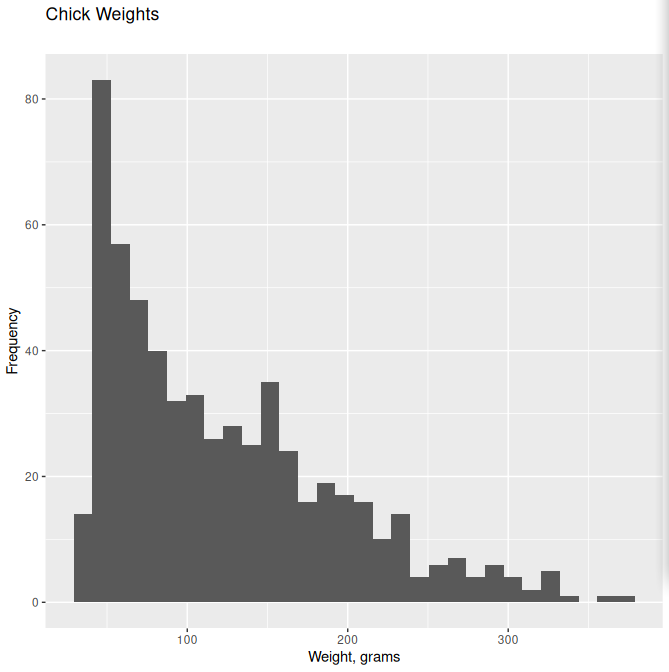
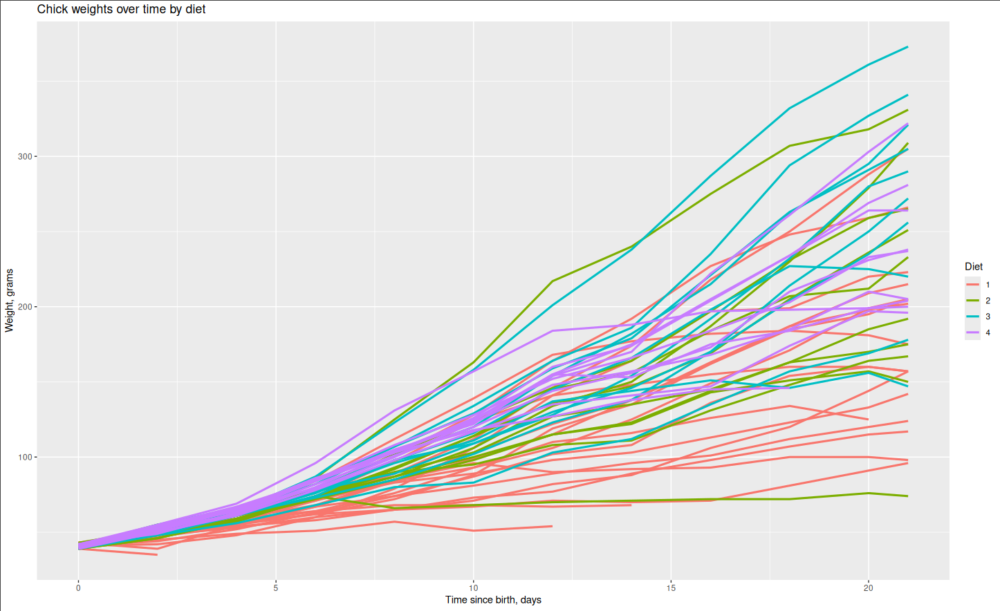

# STA20010 Assignment 1 (103594137)

## Question 1

### Part 1

_Discuss all of the aspects of the dataset including the context and properties._

An experiment was conducted on the effects of diet on the early development of chicks. Chicks were fed diets with varying amounts of protein, and their weights were measured at birth, and every second day from birth, up to day 20, with their final measurement on day 21. The development of ch

There are 578 observations and 4 variables in the dataset:

- There are 2 numeric variables, namely weight and Time. The weight variable contains the measured chick's weight in grams. The Time variable contains the age of the chick in days since birth.

- There are 2 factor variables, namely Chick and Diet. The Chick variable is an ordered factor with 50 levels, that uniquely identifies each chick. The factors are ordered by their final weight amongst the other chicks in the same diet group, from lightest to heaviest (note that the factor number does not correspond to it's order). The Diet variable is a factor containing 4 levels, specifying the type of diet the chick received.

### Part 2

_Look at carefully the variable and discuss any inconsistencies dataset has. Explain your reasoning and the steps you have taken._

A few chicks were only measured up to a certain day, and are missing measurement entries, namely chicks 8, 15, 16, 18, and 44. This is an obvious data inconsistency, as the data is missing observations, and can be explained by chicks dying during the experiment.

These cases should still be included?

Other aspects of the dataset were validated, such as Time recordings being integers between 0 and 21, even numbers (unless 21), and no records existing with duplicate Time and Chick measurements. The dataset was also scanned for any fully duplicate records, yielding no duplicates. The minimum and maximum weights of 35g and 375g respectively are plausible weights of a chick. Checking for incomplete cases yielded no results.

### Part 3

_Produce appropriate summary statistics and graphs to see any association between variables and discuss._

The weight of chicks in the dataset ranges from 35g to 373g, and shows a positively skewed distribution, with a median chick weight of 103g. There is a large amount of variability, as evident by the 

There is an indication that diet has an effect on chick's weight during early development. We can deduce that chicks eating Diet 1 fared the worst, with the majority of deaths being attributed to chicks from this group, and tending to be the lightest 

Conversly, chicks eating Diet 3 or Diet 4 tended to gain the most weight during the experiment.

## Question 2

### Part 1

_Read the dataset in R, obtain the structure of the dataset and discuss._

### Part 2

_Discuss and report any missing values and unusual characters in the dataset._

### Part 3

_Replace unusual values and missing values if exists, in the dataset with NA._

### Part 4

_Impute missing values with appropriate statistic (mean or median) for each variable and explain why you have chosen that particular statistic._

## Question 3

### Part 1

_Read the dataset “Fuel\_Cons\_2022.csv” in R, obtain the structure of the dataset and discuss it._

### Part 2

_Produce a frequency table for the variable “Fuel\_type” and discuss it._

### Part 3

_Obtain a bar plot for the variable “Fuel\_type”_

### Part 4

_Obtain mean and standard deviation for the variable“City\_Fuel” based on “Cylinders” and discuss._

### Part 5 

_List the records of the vehicles where Smog\_Rating= 7, Transmission=” A6” and Fuel\_type=”Z”_

### Part 6

_Obtain a parallel boxplot for the variable “Emission\_co2” by “Fuel\_type” variable and discuss._

### Part 7

_Obtain a histogram for variable “Comb\_Fuel” when Transmission =” A8” and discuss._

### Part 8

_Create a new variable Compare = Emission\_co2/Cylinders*100 attach it to the dataset “Fuel\_Cons\_2022.csv”._

## Question 4

_You are expected to produce graphs and summary statistics to decide which variables are possibly associated with diabetes. All summary statistics and graphs should be referred to support with your decision._

