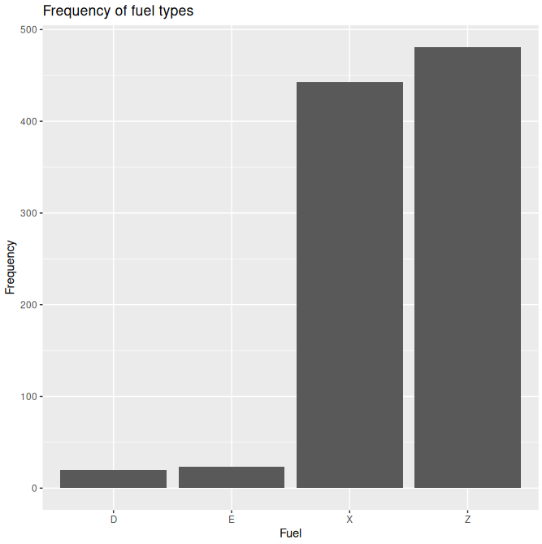
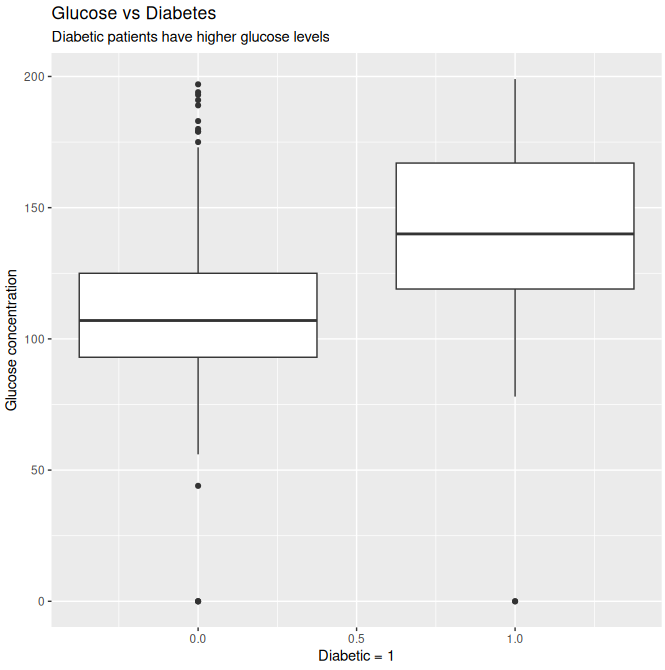

# STA20010 Assignment 1 (103594137)

## Question 1

### 1. _Discuss all of the aspects of the dataset including the context and properties._

The effects of diet on the weight of chicks during early development was investigated by a nutrition student. Chicks were fed 1 of 4 diets, with varying amounts of protein, and their weights were measured at birth, and every second day from birth, up to day 20, and finally measured on day 21.

There are 578 observations and 4 variables in the dataset:

- There are 2 numeric variables, namely "weight" and "Time". "weight" contains the measured chick's weight in grams. "Time" contains the age of the chick in days since birth.

- There are 2 factor variables, namely "Chick" and "Diet". "Chick" is an ordered factor with 50 levels, that uniquely identifies each chick with an integer. The factors are ordered by their final weight amongst the other chicks in the same diet group, from lightest to heaviest (note that the factor number does not correspond to it's order). "Diet" is a factor containing 4 levels, specifying the type of diet the chick received.

### 2. _Look at carefully the variable and discuss any inconsistencies dataset has. Explain your reasoning and the steps you have taken._

A few chicks were only measured up to a certain day, and are missing measurement entries, namely chicks 8, 15, 16, 18, and 44. This is an obvious data inconsistency, as these cases are missing observations, and can be explained by chicks dying during the experiment.

These cases should still be included in the analysis, since there is no inaccuracies in the data present in these cases, and they demonstrate an important event in the experiment.

Another data inconsistency is the time intervals of the experiment, with the final measurement taking place on day 21, leaving a 1 day gap between the previous measurement, whereas all other measurements have a consistent 2 day interval.

Furthermore, the varible naming scheme is inconsistent, with the weight variable name being fully lowercase, while the other variables are sentence case (Time, Chick, Diet).

Other aspects of the dataset were validated, such as Time recordings being integers between 0 and 21, even numbers (unless 21), and no records existing with duplicate Time and Chick measurements. The dataset was also scanned for any fully duplicate records, yielding no duplicates. The minimum and maximum weights of 35g and 375g respectively are plausible weights of a chick. Checking for incomplete cases yielded no results.

### 3. _Produce appropriate summary statistics and graphs to see any association between variables and discuss._

```
> summary(ChickWeight)
     weight           Time           Chick     Diet   
 Min.   : 35.0   Min.   : 0.00   13     : 12   1:220  
 1st Qu.: 63.0   1st Qu.: 4.00   9      : 12   2:120  
 Median :103.0   Median :10.00   20     : 12   3:120  
 Mean   :121.8   Mean   :10.72   10     : 12   4:118  
 3rd Qu.:163.8   3rd Qu.:16.00   17     : 12          
 Max.   :373.0   Max.   :21.00   19     : 12          
                                 (Other):506
```
```
> describeBy(weight, Diet)

 Descriptive statistics by group 
group: 1
   vars   n   mean    sd median trimmed   mad min max range skew kurtosis   se
X1    1 220 102.65 56.66     88   95.31 52.63  35 305   270 1.07     0.61 3.82
------------------------------------------------------------ 
group: 2
   vars   n   mean    sd median trimmed   mad min max range skew kurtosis   se
X1    1 120 122.62 71.61  104.5  113.67 67.46  39 331   292 0.95     0.18 6.54
------------------------------------------------------------ 
group: 3
   vars   n   mean    sd median trimmed   mad min max range skew kurtosis  se
X1    1 120 142.95 86.54  125.5  133.68 90.44  39 373   334 0.76    -0.39 7.9
------------------------------------------------------------ 
group: 4
   vars   n   mean    sd median trimmed   mad min max range skew kurtosis   se
X1    1 118 135.26 68.83  129.5   131.2 84.51  39 322   283  0.4    -0.67 6.34
```


The weight of chicks in the dataset ranges from 35g to 373g, and is positively skewed, with a median chick weight of 103g. The variance in Chick weights is negligible towards day 0, but increases dramatically over time as the chicks age, across all diet groups.

There is an indication that "Diet" has an effect on chick's weight during early development. We can deduce that chicks eating Diet 1 tended to be the most malnourished, with the lowest median weight of 88g, and 4 of the 5 deaths ocurring in chicks from this group. Diet 2 chicks were also typically lighter than groups 3 and 4, with a median weight of 104.5g. Numerous chicks in this group lost weight during the experiment, with one chick maintaining a very low weight of approximately 75g.

Conversely, chicks eating Diet 3 or 4 tended to gain the most weight during the experiment, with the highest median weights (125.5g and 129.5g respectively). Despite diet 4 having the highest median weight, a chick from this group died late in the experiment.

## Question 2

### 1. _Read the dataset in R, obtain the structure of the dataset and discuss._

```
> str(cleaning)
'data.frame':   101 obs. of  16 variables:
 $ ID     : int  1 2 3 4 5 6 7 8 9 10 ...
 $ AGE    : int  18 23 39 24 27 26 26 26 28 24 ...
 $ GENDER : Factor w/ 2 levels "Female","Male": 2 1 2 2 2 2 1 1 2 1 ...
 $ YRSTUDY: int  3 7 10 6 16 16 10 8 9 6 ...
 $ Q1     : int  8 15 9 10 10 10 14 12 9 10 ...
 $ Q2     : int  14 21 12 15 20 16 18 17 15 13 ...
 $ Q3     : int  16 20 14 15 21 16 16 11 21 23 ...
 $ Q4     : int  19 23 12 18 24 18 16 9 23 24 ...
 $ Q5     : int  18 19 22 17 25 18 10 17 24 19 ...
 $ Q6     : int  14 16 20 15 23 18 11 10 23 19 ...
 $ Q7     : int  21 20 16 20 29 20 15 18 21 24 ...
 $ Q8     : int  27 22 22 29 26 27 27 21 23 23 ...
 $ Q9     : int  25 24 26 30 27 24 25 27 20 26 ...
 $ Q10    : int  26 26 26 25 25 25 25 25 25 25 ...
 $ Q11    : int  22 18 23 27 21 25 24 24 26 19 ...
 $ Q12    : int  14 17 15 13 24 14 13 10 22 18 ...
```
The above dataset describes student scores ranked on a scale of 0 to 40 on a series of 12 questions, along with their age, gender, and years of education. The effects of years of study on each question's score varies by age and gender.

There are 101 observations and 16 variables in the dataset:

- There are 15 numeric variables, namely "ID", "AGE", "YRSTUDY", "Q1", "Q2", "Q3", "Q4", "Q5", "Q6", "Q7", "Q8", "Q9", "Q10", "Q11", and "Q12". "ID" contains a number that identifies the student by an integer. "AGE" contains the student's age in years. "YRSTUDY" contains the current year of education the student is studying in. "Q1" to "Q12" contains the student's received score on the relevant question, on a scale from 0 to 40.

- There is 1 factor variable, namely "GENDER". This is a factor with two levels, "Male" and "Female", describing the student's gender.

### 2. _Discuss and report any missing values and unusual characters in the dataset._

```
> summary(cleaning)
       ID           AGE           GENDER      YRSTUDY             Q1       
 Min.   :  1   Min.   :18.00   Female:69   Min.   : 0.000   Min.   : 7.00  
 1st Qu.: 26   1st Qu.:19.00   Male  :32   1st Qu.: 3.000   1st Qu.: 9.00  
 Median : 51   Median :23.00               Median : 6.000   Median :10.00  
 Mean   : 51   Mean   :23.35               Mean   : 6.634   Mean   :10.94  
 3rd Qu.: 76   3rd Qu.:26.00               3rd Qu.: 9.000   3rd Qu.:12.00  
 Max.   :101   Max.   :39.00               Max.   :20.000   Max.   :19.00  
                                                                           
       Q2              Q3              Q4              Q5        
 Min.   : 9.00   Min.   :10.00   Min.   : 9.00   Min.   : 10.00  
 1st Qu.:13.00   1st Qu.:15.00   1st Qu.:15.75   1st Qu.: 15.00  
 Median :15.00   Median :18.00   Median :20.00   Median : 18.00  
 Mean   :15.61   Mean   :18.02   Mean   :19.11   Mean   : 19.23  
 3rd Qu.:19.00   3rd Qu.:21.00   3rd Qu.:23.00   3rd Qu.: 21.00  
 Max.   :28.00   Max.   :30.00   Max.   :30.00   Max.   :120.00  
 NA's   :1                       NA's   :1       NA's   :1       
       Q6              Q7              Q8              Q9       
 Min.   : 9.00   Min.   :13.00   Min.   :19.00   Min.   :16.00  
 1st Qu.:13.00   1st Qu.:16.00   1st Qu.:24.00   1st Qu.:24.00  
 Median :16.00   Median :20.00   Median :26.00   Median :26.00  
 Mean   :16.19   Mean   :20.29   Mean   :25.45   Mean   :25.59  
 3rd Qu.:19.00   3rd Qu.:22.00   3rd Qu.:28.00   3rd Qu.:27.00  
 Max.   :26.00   Max.   :52.00   Max.   :32.00   Max.   :33.00  
                                                                
      Q10             Q11             Q12       
 Min.   :22.00   Min.   :13.00   Min.   :10.00  
 1st Qu.:23.00   1st Qu.:21.00   1st Qu.:15.00  
 Median :24.00   Median :23.00   Median :17.50  
 Mean   :23.73   Mean   :23.01   Mean   :17.61  
 3rd Qu.:25.00   3rd Qu.:25.00   3rd Qu.:20.00  
 Max.   :26.00   Max.   :52.00   Max.   :26.00  
 NA's   :1       NA's   :1       NA's   :1
```

```
> cleaning[!complete.cases(cleaning),]
   ID AGE GENDER YRSTUDY Q1 Q2 Q3 Q4 Q5 Q6 Q7 Q8 Q9 Q10 Q11 Q12
72 72  18 Female      13  9  9 17 15 16 13 15 25 28  23  15  NA
75 75  24 Female       7 10 18 16 18 NA 11 17 22 26  23  NA  17
89 89  24   Male       6 10 NA 11 12 13 15 16 26 21  22  23  13
93 93  27 Female      11  7  9 12 NA 15 13 15 25 24  NA  22  15
```

"Q2", "Q4", "Q5", "Q10", "Q11", and "Q12" contain missing values, totalling 6 NA values.

```
> apply(cleaning[seq(5, 16)], 2, max, na.rm=T) 
 Q1  Q2  Q3  Q4  Q5  Q6  Q7  Q8  Q9 Q10 Q11 Q12 
 19  28  30  30 120  26  52  32  33  26  52  26
```
Questions 5, 7 and 11 contain unusually high values, given that the score scale limit was 40 (120, 52, and 52 respectively).

### 3. _Replace unusual values and missing values if exists, in the dataset with NA._

```
> cleaning$Q5 <- replace(Q5, Q5>40, NA)
cleaning$Q7 <- replace(Q7, Q7>40, NA)
cleaning$Q11 <- replace(Q11, Q11>40, NA)
> apply(cleaning[seq(5, 16)], 2, max, na.rm=T)
 Q1  Q2  Q3  Q4  Q5  Q6  Q7  Q8  Q9 Q10 Q11 Q12 
 19  28  30  30  29  26  31  32  33  26  34  26
```

### 4. _Impute missing values with appropriate statistic (mean or median) for each variable and explain why you have chosen that particular statistic._

```
> apply(cleaning[c(6, 8, 9, 11, 14, 15, 16)], 2, describe, na.rm=T)
$Q2
   vars   n  mean   sd median trimmed  mad min max range skew kurtosis   se
X1    1 100 15.61 4.27     15   15.46 4.45   9  28    19 0.38    -0.28 0.43

$Q4
   vars   n  mean   sd median trimmed  mad min max range  skew kurtosis   se
X1    1 100 19.11 4.57     20   19.14 4.45   9  30    21 -0.07    -0.59 0.46

$Q5
   vars  n  mean   sd median trimmed  mad min max range skew kurtosis   se
X1    1 99 18.21 4.34     18   18.11 4.45  10  29    19 0.18    -0.47 0.44

$Q7
   vars   n  mean sd median trimmed  mad min max range skew kurtosis  se
X1    1 100 19.97  4     20   19.68 4.45  13  31    18 0.41    -0.29 0.4

$Q10
   vars   n  mean   sd median trimmed  mad min max range skew kurtosis  se
X1    1 100 23.73 1.04     24   23.75 1.48  22  26     4 0.07    -0.84 0.1

$Q11
   vars  n  mean   sd median trimmed  mad min max range skew kurtosis   se
X1    1 99 22.72 3.58     23   22.68 2.97  13  34    21 0.17     0.31 0.36

$Q12
   vars   n  mean   sd median trimmed  mad min max range skew kurtosis   se
X1    1 100 17.61 3.21   17.5   17.52 3.71  10  26    16 0.23    -0.28 0.32
```

"Q2", "Q4", "Q5", "Q7", "Q10", "Q11", and "Q12" scores are all approximately normally distributed, as their skews are within -0.5 and 0.5 (skew = 0.38, -0.07, 0.18, 0.41, 0.07, 0.17, and 0.23 respectively). Therefore, it is appropriate to impute these missing values with the mean of each variable, such that no bias is introduced to the dataset:

```
> cleaning$Q2 <- replace(Q2, is.na(Q2), mean(Q2, na.rm=T))
cleaning$Q4 <- replace(Q4, is.na(Q4), mean(Q4, na.rm=T))
cleaning$Q5 <- replace(Q5, is.na(Q5), mean(Q5, na.rm=T))
cleaning$Q7 <- replace(Q7, is.na(Q7), mean(Q7, na.rm=T))
cleaning$Q10 <- replace(Q10, is.na(Q10), mean(Q10, na.rm=T))
cleaning$Q11 <- replace(Q11, is.na(Q11), mean(Q11, na.rm=T))
cleaning$Q12 <- replace(Q12, is.na(Q12), mean(Q12, na.rm=T))
```

## Question 3

### 1. _Read the dataset “Fuel\_Cons\_2022.csv” in R, obtain the structure of the dataset and discuss it._

```
> str(fuel)
'data.frame':   967 obs. of  11 variables:
 $ Make        : Factor w/ 39 levels "Acura","Alfa Romeo",..: 1 1 1 1 1 1 1 1 1 1 ...
 $ Model       : Factor w/ 726 levels "124 Spider","1500",..: 357 433 434 432 536 537 545 634 635 636 ...
 $ Cylinders   : int  4 6 6 6 4 4 6 4 6 6 ...
 $ Transmission: Factor w/ 24 levels "A10","A4","A5",..: 10 16 16 9 11 11 9 10 16 16 ...
 $ Fuel_type   : Factor w/ 4 levels "D","E","X","Z": 4 4 4 4 4 4 4 4 4 4 ...
 $ City_Fuel   : num  9.9 12.3 12.2 9.1 11 11.3 8.4 10.2 11.4 12 ...
 $ Hwy_Fuel    : num  7 9.2 9.5 9 8.6 9.1 8.2 7.4 7.7 8.2 ...
 $ Comb_Fuel   : num  8.6 10.9 11 9 9.9 10.3 8.4 8.9 9.8 10.3 ...
 $ Emission_co2: int  199 254 258 210 232 241 196 209 228 240 ...
 $ Rating_Co2  : int  6 4 4 5 5 5 6 5 5 5 ...
 $ Smog_Rating : int  3 3 3 3 6 6 7 3 3 3 ...
 ```
The above dataset is an extract of fuel consumption ratings and carbon dioxide emissions of various light-duty vehicles sold in Canada. The effects of the model of the light-duty vehicle sold in Canada on overall fuel consumption varies by the transmission, fuel type, and the number of cylinders.

There are 967 observations and 11 variables:

- There are 7 numeric variables, namely Cylinders, City_Fuel, Hwy_Fuel, Comb_Fuel, Emission_co2, Rating_Co2, and Smog_Rating. Cylinders contains the number of pistons in the vehicle's engine. City_Fuel and Hwy_Fuel measure the fuel economy of vehicle in cities and on the highways in mpg. Comb_Fuel contains the average of City_Fuel and Hwy_Fuel. Emission_co2 contains the exhaust emissions in g/km, with Rating_Co2 rating this output on a scale of 1 to 10. Smog_Rating rates the amount of smog-causing pollution the exhaust produces on a scale of 1 to 10.

- There are 4 factor variables, namely Make (39 levels), Model (726 levels), Transmission (24 levels), and Fuel_type (4 levels). Make contains the name of the vehicle brand. Model contains the name of the vehicle. Transmission describes the gearbox, with A = automatic, AM = automated manual, AS = automatic with select shift, AV = continuously variable, and M = manual. The ending number indicates how many gears the transmission has (3 to 10). Fuel_type contains 4 types of fuel, namely X = regular gasoline, Z = premium gasoline, D = diesel, and E = E85.

### 2. _Produce a frequency table for the variable “Fuel\_type” and discuss it._

```
> t <- table(Fuel_type)
> t
Fuel_type
  D   E   X   Z 
 20  23 443 481
```
From the above frequency table, fuel type D is the least commonly used (20), whereas fuel type Z is the most commonly used (481). There is a large discrepancy in usages between fuel types D and E (20 and 23 respectively) and fuel types X and Z (443 and 481 respectively). This could be attributed to fuel types D and E being harder or more expensive to produce, demand for fuel types X and Z, or varying environmental regulations between regions, restricting the usage of fuel types D and E.

### 3. _Obtain a bar plot for the variable “Fuel\_type”_



### 4. _Obtain mean and standard deviation for the variable“City\_Fuel” based on “Cylinders” and discuss._

```
> describeBy(City_Fuel, Cylinders)

 Descriptive statistics by group 
group: 3
   vars  n mean   sd median trimmed  mad min max range  skew kurtosis   se
X1    1 12 8.52 0.93    8.6    8.58 0.52 6.6 9.8   3.2 -0.61     -0.5 0.27
------------------------------------------------------------ 
group: 4
   vars   n mean   sd median trimmed  mad min  max range  skew kurtosis   se
X1    1 425 9.89 1.78   10.1   10.03 1.63 4.2 14.3  10.1 -0.85     1.01 0.09
------------------------------------------------------------ 
group: 5
   vars n mean sd median trimmed mad  min  max range skew kurtosis se
X1    1 2 12.1  0   12.1    12.1   0 12.1 12.1     0  NaN      NaN  0
------------------------------------------------------------ 
group: 6
   vars   n  mean  sd median trimmed  mad min  max range skew kurtosis  se
X1    1 295 12.89 1.7   12.8    12.8 1.33 7.5 22.1  14.6 1.17      5.6 0.1
------------------------------------------------------------ 
group: 8
   vars   n  mean   sd median trimmed  mad  min  max range skew kurtosis   se
X1    1 202 16.25 2.14   15.8   15.96 1.63 12.8 24.5  11.7 1.29     1.66 0.15
------------------------------------------------------------ 
group: 10
   vars n  mean   sd median trimmed mad  min max range  skew kurtosis   se
X1    1 6 17.83 0.26     18   17.83   0 17.5  18   0.5 -0.54    -1.96 0.11
------------------------------------------------------------ 
group: 12
   vars  n  mean   sd median trimmed  mad  min  max range skew kurtosis  se
X1    1 23 20.61 3.37     20   20.32 1.19 15.5 28.1  12.6 1.09     0.24 0.7
------------------------------------------------------------ 
group: 16
   vars n mean   sd median trimmed mad  min  max range skew kurtosis  se
X1    1 2   27 0.28     27      27 0.3 26.8 27.2   0.4    0    -2.75 0.2
```

The "City_Fuel" mean consumption by "Cylinders" ranges from 8.52 mpg to 27 mpg. There is a definite positive trend in city fuel consumption and number of cylinders, with each increase in cylinders resulting in a higher mean fuel consumption. Light-duty vehicles with more cylinders tend to consume higher amounts of fuel in the city.

### 5. _List the records of the vehicles where Smog\_Rating= 7, Transmission=” A6” and Fuel\_type=”Z”_

```
> fuel[Smog_Rating==7 & Transmission=="A6" & Fuel_type=="Z", ]
 [1] Make         Model        Cylinders    Transmission Fuel_type   
 [6] City_Fuel    Hwy_Fuel     Comb_Fuel    Emission_co2 Rating_Co2  
[11] Smog_Rating 
<0 rows> (or 0-length row.names)
```

### 6. _Obtain a parallel boxplot for the variable “Emission\_co2” by “Fuel\_type” variable and discuss._



```
> describeBy(Emission_co2, Fuel_type)

 Descriptive statistics by group 
group: D
   vars  n  mean    sd median trimmed   mad min max range skew kurtosis  se
X1    1 20 266.8 19.66  264.5  264.94 13.34 238 326    88 1.16     1.72 4.4
------------------------------------------------------------ 
group: E
   vars  n   mean    sd median trimmed   mad min max range  skew kurtosis   se
X1    1 23 293.87 36.13    298  298.53 31.13 208 342   134 -1.11     0.29 7.53
------------------------------------------------------------ 
group: X
   vars   n   mean   sd median trimmed   mad min max range skew kurtosis   se
X1    1 443 232.68 57.3    229  231.56 62.27  96 385   289 0.15    -0.49 2.72
------------------------------------------------------------ 
group: Z
   vars   n  mean    sd median trimmed   mad min max range skew kurtosis   se
X1    1 481 272.8 59.47    263  267.08 53.37 167 537   370  1.2     2.47 2.71
```

As seen from the boxplot, fuel type X causes the lowest amount of CO2 emissions, and is approximately symmetric (skew = 0.15), with a median emission of 229g/km. Fuel type Z has the second lowest CO2 emissions with a median emission of 263g/km, and is a positively skewed distribution (skew = 1.2), with the most outliers (6). It also has the greatest variance out of all the fuel types.

Meanwhile, fuel type D has the second highest CO2 emissions, with a median emission of 264.5g/km, and is positively skewed (skew = 1.16), with a single outlier. Fuel type E has the highest CO2 emissions, with a median emission of 298g/gm, and is negatively skewed, (skew = -1.11) with 2 outliers.

### 7. _Obtain a histogram for variable “Comb\_Fuel” when Transmission = ”A8” and discuss._


```
> describe(fuel[Transmission=="A8",]$Comb_Fuel)
   vars  n  mean  sd median trimmed  mad min  max range skew kurtosis   se
X1    1 77 11.95 1.8   11.8    11.9 1.48 7.9 17.7   9.8 0.38     0.52 0.21
```

As seen from the histogram, "Comb_Fuel" when "Transmission" = "A8" is approximately normal, (skew = 0.38) with a mean overall fuel consumption of 11.95mpg (sd = 1.8). The overall consumption ranges from 7.9mpg to 17.7mpg (range = 9.8).

### 8. _Create a new variable Compare = Emission\_co2/Cylinders*100 attach it to the dataset “Fuel\_Cons\_2022.csv”._

```
> fuel$Compare <- Emission_co2/Cylinders*100
head(fuel)
   Make             Model Cylinders Transmission Fuel_type City_Fuel Hwy_Fuel
1 Acura               ILX         4          AM8         Z       9.9      7.0
2 Acura        MDX SH-AWD         6          AS9         Z      12.3      9.2
3 Acura MDX SH-AWD A-SPEC         6          AS9         Z      12.2      9.5
4 Acura    MDX Hybrid AWD         6          AM7         Z       9.1      9.0
5 Acura           RDX AWD         4         AS10         Z      11.0      8.6
6 Acura    RDX AWD A-SPEC         4         AS10         Z      11.3      9.1
  Comb_Fuel Emission_co2 Rating_Co2 Smog_Rating  Compare
1       8.6          199          6           3 4975.000
2      10.9          254          4           3 4233.333
3      11.0          258          4           3 4300.000
4       9.0          210          5           3 3500.000
5       9.9          232          5           6 5800.000
6      10.3          241          5           6 6025.000
```

## Question 4

### _You are expected to produce graphs and summary statistics to decide which variables are possibly associated with diabetes. All summary statistics and graphs should be referred to support with your decision._

```
diabetes <- read.csv("diabetes.csv")
str(diabetes)

'data.frame':   768 obs. of  9 variables:
 $ Pregnancies             : int  6 1 8 1 0 5 3 10 2 8 ...
 $ Glucose                 : int  148 85 183 89 137 116 78 115 197 125 ...
 $ BloodPressure           : int  72 66 64 66 40 74 50 0 70 96 ...
 $ SkinThickness           : int  35 29 0 23 35 0 32 0 45 0 ...
 $ Insulin                 : int  0 0 0 94 168 0 88 0 543 0 ...
 $ BMI                     : num  33.6 26.6 23.3 28.1 43.1 25.6 31 35.3 30.5 0 ...
 $ DiabetesPedigreeFunction: num  0.627 0.351 0.672 0.167 2.288 ...
 $ Age                     : int  50 31 32 21 33 30 26 29 53 54 ...
 $ Outcome                 : int  1 0 1 0 1 0 1 0 1 1 ...
```
The above dataset describes medical diagnostics from female patients aged 21 years or older of Pima Indian descent, sourced from the National Institute of Diabetes and Digestive and Kidney Diseases.

There are 768 observations and 9 variables:

- There are 9 numeric variables, namely "Pregnancies", "Glucose", "BloodPressure", "SkinThickness", "Insulin", "BMI", "DiabetesPedigreeFunction", "Age", and "Outcome". "Pregnancies" is the number of times the patient has been pregnant. "Glucose" is the Plasma Glucose concentration in a 2 hour oral glucose tolerance test. "BloodPressure" contains the patient's Diastolic Blood Pressure, measured in mm hg. "SkinThickness" contains the Triceps skin fold thickness in mm. "Insulin" contains the 2 hour serum insulin, measured in mu U/ml. "BMI" contains the Body Mass Index of the patient. "Age" contains the patient's age in years. "DiabetesPedigreeFunction" scores the likelihood the patient has diabetes based on family history. "Outcome" indicates whether the patient has Diabetes, being either 0 or 1.

The effects of age on whether Pima Indian women aged 21 years or older are diabetic varies by number of pregnancies, Plasma Glucose concentration, blood pressure, skin thickness, insulin levels, BMI, and family history.


```
> describeBy(Age, Outcome)

 Descriptive statistics by group 
group: 0
   vars   n  mean    sd median trimmed  mad min max range skew kurtosis   se
X1    1 500 31.19 11.67     27   28.98 7.41  21  81    60 1.56     1.91 0.52
------------------------------------------------------------ 
group: 1
   vars   n  mean    sd median trimmed   mad min max range skew kurtosis   se
X1    1 268 37.07 10.97     36   36.28 11.86  21  70    49 0.58    -0.38 0.67
```
From the above boxplot, diabetic patients have the higher median age of 36 years old, with a slight positive skew (skew = 0.58). Meanwhile, non-diabetic patients have a median age of 27 years of age, and are more positively skewed (skew = 1.56). There are many non-diabetic outliers. Both plots have a similar variance.


```
> describeBy(Glucose, Outcome)

 Descriptive statistics by group 
group: 0
   vars   n   mean    sd median trimmed   mad min max range skew kurtosis   se
X1    1 500 109.98 26.14    107  108.87 23.72   0 197   197 0.17     1.85 1.17
------------------------------------------------------------ 
group: 1
   vars   n   mean    sd median trimmed   mad min max range  skew kurtosis   se
X1    1 268 141.26 31.94    140  141.69 35.58   0 199   199 -0.49     1.35 1.95
```

Diabetic patients also have higher "Glucose", with a median concentration of 140, and an approximately normal distribution (skew = -0.49). 


Ultimately, the diabetes "Outcome" for Pima Indian women aged 21 years or older can be best described by "Glucose" concentration and "Age". Older patients with higher Glucose concentration levels are more likely to have diabetes.