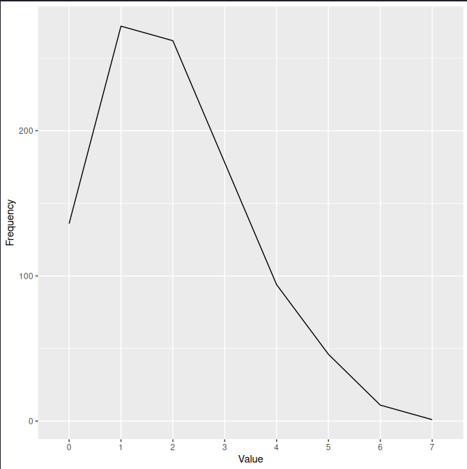
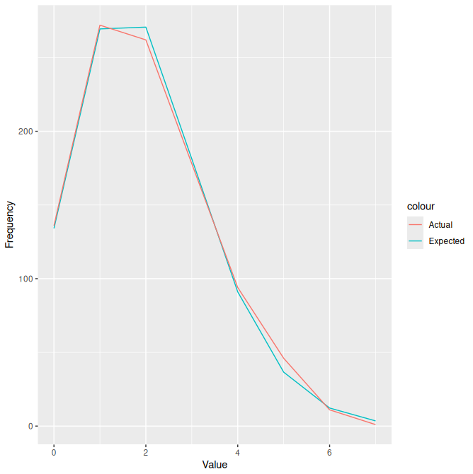
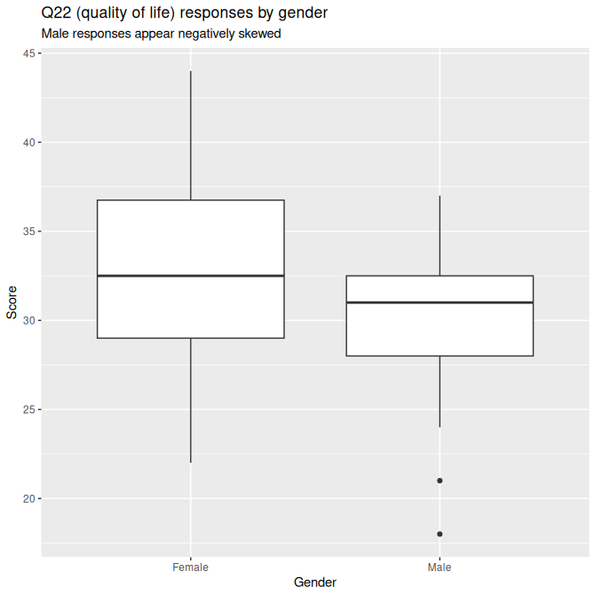
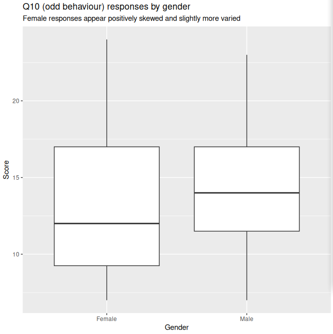

# STA20010 Assignment 2 (103594137)

## Question 1 

_A supermarket sells brown and white eggs in small, medium, large and extra-large sizes. The table below shows the numbers of cartons sold for the various sizes and egg type during a one-week period._

| Type of Egg | Small | Medium | Large | X-Large |
|-|-|-|-|-|
| **Brown** | 286 | 217 | 123 | 114 |
| **White** | 406 | 359 | 208 | 407 |

### _a. Create a matrix with the above information._

```
> eggs <- matrix(c(286, 217, 123, 114, 406, 359, 208, 407), nrow=2, byrow=T)
> colnames(eggs) <- c("Small", "Medium", "Large", "X-Large")
> rownames(eggs) <- c("Brown", "White")
> eggs
      Small Medium Large X-Large
Brown   286    217   123     114
White   406    359   208     407
```

### _b. Calculate the expected frequencies (correct to 1 decimal place), assuming no association between the egg size and type of egg._

```
get_expected <- function(mat, col, row) {
  return(round(sum(mat[row,]) * sum(mat[,col]) / sum(mat), 1))
}

expected <- eggs

expected['Brown', ] <- sapply(seq(1,4), get_expected, mat=eggs, row=1)
expected['White', ] <- sapply(seq(1,4), get_expected, mat=eggs, row=2)

expected
      Small Medium Large X-Large
Brown 241.5  201.1 115.5   181.9
White 450.5  374.9 215.5   339.1
```

### _c. State appropriate hypotheses and then carry out the relevant hypothesis test, at the 5% level of significance, to determine if there is an association between the Egg size and Type of egg._

H0 (Null hypothesis): In the population, the Egg size and Type of egg are independent.

H1 (Alternative hypothesis): In the population, the Egg size and Type of egg are dependent.

A Chi-square test was carried out at the 95% confidence level (a = 0.05, all cell counts are greater than 5):

```
> chisq.test(eggs)

        Pearson's Chi-squared test

data:  eggs
X-squared = 54.149, df = 3, p-value = 1.043e-11
```
The p-value was less than 0.001 (p < 0.001), thus the null hypothesis is not rejected. At 5% level of significance, data does not provide sufficient evidence to conclude that the Egg size and egg Type of purchased cartons are dependent.

## Question 2

_The probability that a student must stop at any one traffic light coming to Swinburne University is 0.3. There are 15 sets of traffic lights on the journey._

### _a. What is the probability that a student stops at the first 5 traffic lights and do not stop at the remaining sets of traffic lights?_

```
> dbinom(5, 15, 0.3, log=F)
[1] 0.2061304
```

### _b. What is the probability that a student will be stopped at 1 or more of the 15 sets of traffic lights?_

```
> pbinom(0, size=15, prob=0.3, log=F, lower.tail=F)
[1] 0.9952524
```

### _c. What is the probability that a student will stop at least 5 set of traffic lights given that the student stopped at most 10 set of traffic lights?_

```
> sum(dbinom(5:10, 15, 0.3, log=F))/pbinom(10, 15, 0.3, log=F)
[1] 0.4841622
```

### _d. What is the probability that a student stops at 3 of the first 5 traffic lights and stops at 5 of the remaining 10 sets of traffic lights?_

```
> dbinom(3, 5, 0.3, log=F)*dbinom(5, 10, 0.3, log=F)
[1] 0.01361623
```

## Question 3

_The number of vehicles pass a bridge in one-minute interval were recorded over 1000 minutes given in the dataset "no\_vehicles.csv"._

### _a. Read the dataset in R and obtain the frequency distribution._

```
> passes <- read.csv("no_vehicles.csv")
> require("ggplot2")
> freqs <- table(passes$no_of.vec)
> ggplot(data.frame(Vehicles=names(freqs), Frequency=as.vector(freqs)), aes(x=Vehicles, y=Frequency, group=1)) + geom_line() + ggtitle("Frequency of vehicle crossings in one minute")
```


### _b. Compute the mean number of vehicles pass the bridge per minute._

```
> mean(passes$no_of.vec)
[1] 2.009
```

### _c. Using part (b) as the lambda value, rate parameter of a Poisson distribution, compute the probabilities for each of the observed values in the frequency distribution._

```
> pois <- data.frame(Value = seq(0,7), Probability = sapply(seq(0,7), dpois, lambda=2.009, log=F))
> pois
  Value Probability
1     0 0.134122730
2     1 0.269452565
3     2 0.270665102
4     3 0.181255397
5     4 0.091035523
6     5 0.036578073
7     6 0.012247558
8     7 0.003515049
```

### _d. Compute the expected frequencies for each value in the frequency distribution._

```
> expected <- data.frame(Value = seq(0,7), Expected = pois$Probability * 1000)
> expected
  Value   Expected
1     0 134.122730
2     1 269.452565
3     2 270.665102
4     3 181.255397
5     4  91.035523
6     5  36.578073
7     6  12.247558
8     7   3.515049
```

### _e. Compare the expected frequencies to those actually observed values from the "no\_vehicles.csv", dataset and comment on your findings ( i.e the actual and expected values agree)_

```
> expected$Actual <- table(passes$no_of.vec)
> ggplot(expected, aes(Value)) + 
        geom_line(aes(y = Expected, colour="Expected")) +
        geom_line(aes(y = Actual, colour="Actual")) + 
        ylab("Frequency") +
        ggtitle("Actual vs expected vehicle frequencies")
```


Overall, the actual values mostly agree with the expected values, with values 0, 3, 4, and 6 having a nearly identical frequency of vehicle crossings. For values 2 and 7, there were slightly less vehicle crossings than expected. Conversely, values 1 and 5 had slightly more vehicle crossings than expected.

## Question 4

_Suppose birth weights of full-term babies have a normal distribution with mean μ = 3100 grams and standard deviation σ = 600 grams._

### _a. What is the probability that a randomly selected baby will have a birth weight between 2800 and 4100 grams?_

```
> pnorm(4100, mean=3100, sd=600) - pnorm(2800, mean=3100, sd=600)
[1] 0.6436721
```

### _b. What are the 25th and 75 percentiles of birth weights? Hence find the interquartile Range of the birth weights._

```
> q1 <- qnorm(0.25, mean=3100, sd=600)
> q1
[1] 2695.306
> q3 <- qnorm(0.75, mean=3100, sd=600)
> q3
[1] 3504.694
> q3-q1
[1] 809.3877
```

### _c. From a hospital database, 10 babies’ weights were randomly selected. What is the probability that two of the ten babies’ weight between 3100 and 4200 grams?_

```
> pnorm(4100, mean=3100, sd=600) - pnorm(3100, mean=3100, sd=600)
[1] 0.4522096
> dbinom(2, 10, 0.4522096)
[1] 0.07461178
```

## Question 5


```r
> correlation_s <- function(x, y, n) {
    sm_x <- sum(x) / n
    sm_y <- sum(y) / n
    s_xy <- sum((x - sm_x)*(y - sm_y))/(n - 1)
    s_x <- sqrt(sum((x - sm_x) ^ 2)/(n - 1))
    s_y <- sqrt(sum((y - sm_y) ^ 2)/(n - 1))
    r <- s_xy / (s_x * s_y)
    return(r)
}
```

## Question 6

_The dataset was extracted from a study investigated the adequacy of the AQ and SPQ questions in differentiating their respective spectrum disorder traits and the subscale of the related questions in the questionnaire given below._

| Variable | Description |
|-|-|
| ID | ID number |
| AGE | Age of the participant |
| Gender | Gender |
| YRSTUDY | years of study |
| Q10 | Odd behaviour |
| Q15 | Communication |
| Q22 | Quality of Life |

### _a. It is often felt that on average female have better quality of life than male counterpart. Check all the assumptions and choose an appropriate hypothesis test to investigate this contention using the variables from your data._

H0 (Null hypothesis): In the population, female mean quality of life is equal to mean male quality of life.

H1 (Alternative hypothesis): In the population, female mean quality of life is greater than mean male quality of life.

The following assumptions need to be verified:
  - Two groups are independent
  - Samples have approximately equal variances, and 
  - Samples are drawn from normally distributed populations

```
> require("ggplot2")
> q6 <- read.csv('Assignment2_Q6.csv')
> ggplot(q6, aes(y = Q22, x = X)) + 
        geom_boxplot() +
        ggtitle("Q22 (quality of life) responses by gender", subtitle = "Male responses appear negatively skewed") +
        xlab("Gender") +
        ylab("Score")

> leveneTest(q6$Q22 ~ q6$X, data = q6)
Levene's Test for Homogeneity of Variance (center = median)
      Df F value Pr(>F)
group  1  2.4901 0.1178
      99
```



```
> shapiro.test(q6[q6$X == "Male", "Q22"])

        Shapiro-Wilk normality test

data:  q6[q6$X == "Male", "Q22"]
W = 0.91286, p-value = 0.02666
> shapiro.test(q6[q6$X == "Female", "Q22"])

        Shapiro-Wilk normality test

data:  q6[q6$X == "Female", "Q22"]
W = 0.9824, p-value = 0.3922
```
From the study design, the two groups Male and Female are independent. As seen from the boxplot, Female and Male Q22 responses appear to have roughly equal variance, with the Levene test confirming this (0.1178 > 0.05). Male Q22 responses seem to be negatively skewed, whereas Female responses appear normal, as confirmed by the Shapiro-Wilk tests (Female p > 0.05, Male p < 0.05). However, the sample size is sufficiently large (101 > 30), thus it can be assumed the sample means are approximately normal. Therefore, a two sample t-test with pooled variance can be carried out:

```
> t.test(q6$Q22 ~ q6$X, alternative="greater", var.equal=T)

        Two Sample t-test

data:  q6$Q22 by q6$X
t = 2.5203, df = 99, p-value = 0.006662
alternative hypothesis: true difference in means between group Female and group Male is greater than 0
95 percent confidence interval:
 0.9057404       Inf
sample estimates:
mean in group Female   mean in group Male 
            32.43243             29.77778 
```
The calculated p-value is 0.006662 < 0.05. Therefore, we reject the null hypothesis in favour of the alternative hypothesis at 5% level of significance.

We could conclude that based on the samples considered, the population mean scores of quality of life between the two genders are different to one another. Sample mean quality of life for the female group is more than the male group, and the difference is statistically significant.

### _b. It is often felt that the on average female have more odd behaviours than male counterpart. Check all the assumptions and choose an appropriate hypothesis test to investigate this contention using two of the variables from your data._

H0 (Null hypothesis): In the population, female mean odd behaviour is equal to male mean odd behaviour.

H1 (Alternative hypothesis): In the population, female mean odd behaviour is greater than male mean odd behaviour.

The following assumptions need to be verified:
  - Two groups are independent
  - Samples have approximately equal variances, and 
  - Samples are drawn from normally distributed populations

```
> ggplot(q6, aes(y = Q10, x = X)) + 
        geom_boxplot() +
        ggtitle("Q10 (odd behaviour) responses by gender", subtitle = "Female responses appear positively skewed and slightly more varied") +
        xlab("Gender") +
        ylab("Score")

> leveneTest(q6$Q10 ~ q6$X, data = q6)
Levene's Test for Homogeneity of Variance (center = median)
      Df F value Pr(>F)
group  1  0.2368 0.6276
      99
```




```
> shapiro.test(q6[q6$X == "Male", "Q10"])

        Shapiro-Wilk normality test

data:  q6[q6$X == "Male", "Q10"]
W = 0.95887, p-value = 0.3482
> shapiro.test(q6[q6$X == "Female", "Q10"])

        Shapiro-Wilk normality test

data:  q6[q6$X == "Female", "Q10"]
W = 0.92439, p-value = 0.000277
```
From the study design, the two groups Male and Female are independent. As seen from the boxplot, the female variance appears slightly greater, however the Levene's test is 0.6276 > 0.05, thus the variances are approximately equal. Moreover, Male scores appear normal, whereas Female scores appear positively skewed, as confirmed by the Shapiro-Wilk tests (Male p 0.3482 > 0.05, Female p 0.000277 < 0.05). However, the sample size is sufficiently large (101 > 30), thus it can be assumed the sample means are approximately normal. Therefore, a two sample t-test using pooled variance can be carried out:

```
> t.test(q6$Q10 ~ q6$X, alternative="greater", var.equal=T)

        Two Sample t-test

data:  q6$Q10 by q6$X
t = -1.2268, df = 99, p-value = 0.8886
alternative hypothesis: true difference in means between group Female and group Male is greater than 0
95 percent confidence interval:
 -3.001315       Inf
sample estimates:
mean in group Female   mean in group Male 
            13.24324             14.51852
```
The calculated p value is 0.8886 > 0.05. Therefore, we reject the alternative hypothesis in favour of the null hypothesis at 5% level of significance.

We could conclude that based on the samples considered, the population mean scores of odd behaviour between the two genders are not different to one another. Sample mean odd behaviour for the male group is more than the female group, but the observed difference is not statistically significant.

## Question 7

_The following table was derived from the Business Review Weekly’s list of 132 fastest growing companies._

| Type of company | NSW | VIC | QLD | Other |
|-|-|-|-|-|
| **Finance** | 18 | 14 | 9 | 7 |
| **Software** | 21 | 8 | 7 | 5 |
| **Other** | 8 | 11 | 9 | 15 |

_Based on this table, if a company is chosen at random, what is the probability (correct to 4 decimal places) that:_

### _a. the company is a QLD company._

```
> round((9 + 7 + 9)/132, 4)
[1] 0.1894
```

### _b. the company is a finance company given that it is NOT from NSW, VIC, or QLD?_

```
> round((7/132)/((7 + 5 + 15)/132), 4)
[1] 0.2593
```

### _c. the company is either a software company or is from NSW?_

```
> round((21 + 8 + 7 + 5)/132 + (18 + 21 + 8)/132 - 21/132, 4)
[1] 0.5076
```