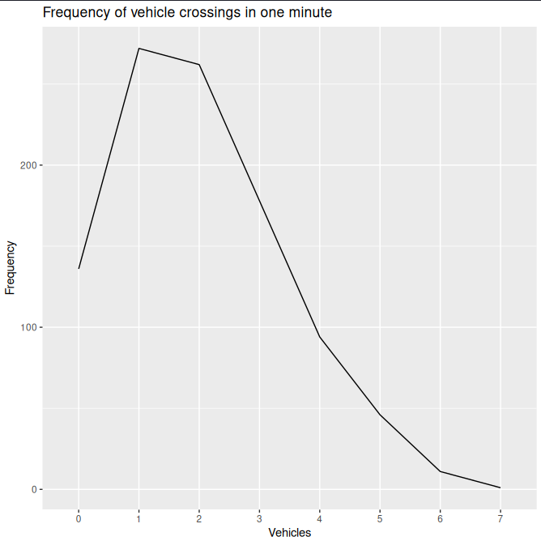
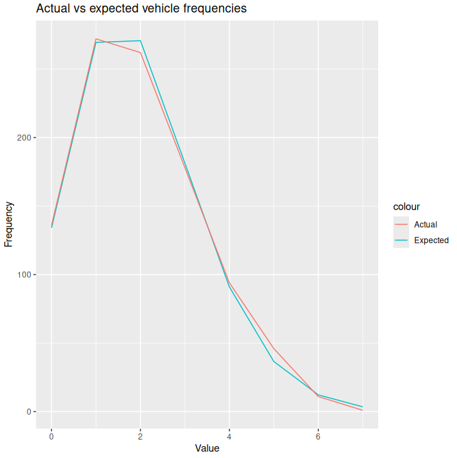

# STA20010 Assignment 2 (103594137)

## Question 1 

_A supermarket sells brown and white eggs in small, medium, large and extra-large sizes. The table below shows the numbers of cartons sold for the various sizes and egg type during a one-week period._

| Type of Egg | Small | Medium | Large | X-Large |
|-|-|-|-|-|
| Brown | 286 | 217 | 123 | 114 |
| White | 406 | 359 | 208 | 407 |

### _a. Create a matrix with the above information._

```
> eggs <- matrix(c(286, 217, 123, 114, 406, 359, 208, 407), nrow=2, byrow=T)
> colnames(eggs) <- c("Small", "Medium", "Large", "X-Large")
> rownames(eggs) <- c("Brown", "White")
> eggs
      Small Medium Large X-Large
Brown   286    217   123     114
White   406    359   208     407
```

### _b. Calculate the expected frequencies (correct to 1 decimal place), assuming no association between the egg size and type of egg._


### _c. State appropriate hypotheses and then carry out the relevant hypothesis test, at the 5% level of significance, to determine if there is an association between the Egg size and Type of egg._


## Question 2

_The probability that a student must stop at any one traffic light coming to Swinburne University is 0.3. There are 15 sets of traffic lights on the journey._

### _a. What is the probability that a student stops at the first 5 traffic lights and do not stop at the remaining sets of traffic lights?_

```
> dbinom(x=5, size=15, prob=0.3, log=F)
[1] 0.2061304
```

### _b. What is the probability that a student will be stopped at 1 or more of the 15 sets of traffic lights?_

```
> pbinom(0, size=15, prob=0.3, lower.tail=F)
[1] 0.9952524
```

### _c. What is the probability that a student will stop at least 5 set of traffic lights given that the student stopped at most 10 set of traffic lights?_

```
> sum(dbinom(5:10, 15, 0.3))/sum(dbinom(5:15, 15, 0.3))
[1] 0.9986125
```

### _d. What is the probability that a student stops at 3 of the first 5 traffic lights and stops at 5 of the remaining 10 sets of traffic lights?_

```
> dbinom(8, 15, 0.3)
[1] 0.03477001
```

## Question 3

_The number of vehicles pass a bridge in one-minute interval were recorded over 1000 minutes given in the dataset "no\_vehicles.csv"._

### _a. Read the dataset in R and obtain the frequency distribution._

```
> passes <- read.csv("no_vehicles.csv")
> require("ggplot2")
> freqs <- table(passes$no_of.vec)
> ggplot(data.frame(Value=names(freqs), Frequency=as.vector(freqs)), aes(x=Value, y=Frequency, group=1)) + geom_line()
```


### _b. Compute the mean number of vehicles pass the bridge per minute._

```
> mean(passes$no_of.vec)
[1] 2.009
```

### _c. Using part (b) as the lambda value, rate parameter of a Poisson distribution, compute the probabilities for each of the observed values in the frequency distribution._

```
> pois <- data.frame(Value = seq(0,7), Probability = sapply(seq(0,7), dpois, lambda=2.009, log=F))
> pois
  Value Probability
1     0 0.134122730
2     1 0.269452565
3     2 0.270665102
4     3 0.181255397
5     4 0.091035523
6     5 0.036578073
7     6 0.012247558
8     7 0.003515049
```

### _d. Compute the expected frequencies for each value in the frequency distribution._

```
> expected <- data.frame(Value = seq(0,7), Expected = pois$Probability * 1000)
> expected
  Value   Expected
1     0 134.122730
2     1 269.452565
3     2 270.665102
4     3 181.255397
5     4  91.035523
6     5  36.578073
7     6  12.247558
8     7   3.515049
```

### _e. Compare the expected frequencies to those actually observed values from the "no\_vehicles.csv", dataset and comment on your findings ( i.e the actual and expected values agree)_

```
> expected$Actual <- table(passes$no_of.vec)
> ggplot(expected, aes(Value)) + geom_line(aes(y = Expected, colour="Expected")) + geom_line(aes(y = Actual, colour="Actual")) + ylab("Frequency")
```


Overall, the actual values mostly agree with the expected values, with values 0, 3, 4, and 6 having a nearly identical frequency of vehicle crossings. For values 2 and 7, there were slightly less vehicle crossings than expected. Conversely, values 1 and 5 had slightly more vehicle crossings than expected.

## Question 4

_Suppose birth weights of full-term babies have a normal distribution with mean μ = 3100 grams and standard deviation σ = 600 grams._

### _a. What is the probability that a randomly selected baby will have a birth weight between 2800 and 4100 grams?_

```
> pnorm(4100, mean=3100, sd=600) - pnorm(2800, mean=3100, sd=600, lower.tail=T)
[1] 0.6436721
```

### _b. What are the 25th and 75 percentiles of birth weights? Hence find the interquartile Range of the birth weights._

```
> q1 <- qnorm(0.25, mean=3100, sd=600)
> q1
[1] 2695.306
> q3 <- qnorm(0.75, mean=3100, sd=600)
> q3
[1] 3504.694
> q3-q1
[1] 809.3877
```

### _c. From a hospital database, 10 babies’ weights were randomly selected. What is the probability that two of the ten babies’ weight between 3100 and 4200 grams?_

```
> pnorm(4100, mean=3100, sd=600) - pnorm(3100, mean=3100, sd=600, lower.tail=T)
[1] 0.4522096
> dbinom(2, 10, 0.4522096)
[1] 0.07461178
```

## Question 5

_Suppose a dataset has two numerical variables, $X$ and $Y$. Write a function in R to compute the sample correlation $r\\_X\\_Y$ between the two variables, $X$ and $Y$ is given by_

$$ r\\_X\\_Y = {S\\_X\\_Y \over S\\_YS\\_X} $$

_where_

$$ S\\_X\\_Y = {\sum\\_1^n(X - \bar{X})(Y - \bar{Y}) \over n - 1}, S\\_X = \sqrt{\sum\\_1^n(X - \bar{X})^2 \over n - 1}, S\\_Y = \sqrt{\sum\\_1^n(Y - \bar{Y})^2 \over n - 1} $$

_and $n$ is the sample size and $\bar{X}$ and $\bar{Y}$ are the sample means for the variables $X$ and $Y$._

```
> correlation_s <- function(x, y, n) {
    sm_x <- sum(x) / n
    sm_y <- sum(y) / n
    s_xy <- sum((x - sm_x)*(y - sm_y))/(n - 1)
    s_x <- sqrt(sum((x - sm_x) ^ 2)/(n - 1))
    s_y <- sqrt(sum((y - sm_y) ^ 2)/(n - 1))
    r <- s_xy / (s_x * s_y)
    return(r)
}
```

## Question 6

_The dataset was extracted from a study investigated the adequacy of the AQ and SPQ questions in differentiating their respective spectrum disorder traits and the subscale of the related questions in the questionnaire given below._

| Variable | Description |
|-|-|
| ID | ID number |
| AGE | Age of the participant |
| Gender | Gender |
| YRSTUDY | years of study |
| Q10 | Odd behaviour |
| Q15 | Communication |
| Q22 | Quality of Life |

### _a. It is often felt that on average female have better quality of life than male counterpart. Check all the assumptions and choose an appropriate hypothesis test to investigate this contention using the variables from your data._


### _b. It is often felt that the on average female have more odd behaviours than male counterpart. Check all the assumptions and choose an appropriate hypothesis test to investigate this contention using two of the variables from your data._


## Question 7

_The following table was derived from the Business Review Weekly’s list of 132 fastest growing companies._

| Type of company | NSW | VIC | QLD | Other |
|-|-|-|-|-|
| Finance | 18 | 14 | 9 | 7 |
| Software | 21 | 8 | 7 | 5 |
| Other | 8 | 11 | 9 | 15 |

_Based on this table, if a company is chosen at random, what is the probability (correct to 4 decimal places) that:_

### _a. the company is a QLD company._

```
> round((9 + 7 + 9)/132, 4)
[1] 0.1894
```

### _b. the company is a finance company given that it is NOT from NSW, VIC, or QLD?_

```
> round((7/132)/((7 + 5 + 15)/132), 4)
[1] 0.2593
```

### _c. the company is either a software company or is from NSW?_

```
> round((21 + 8 + 7 + 5)/132 + (18 + 21 + 8)/132 - 21/132, 4)
[1] 0.5076
```